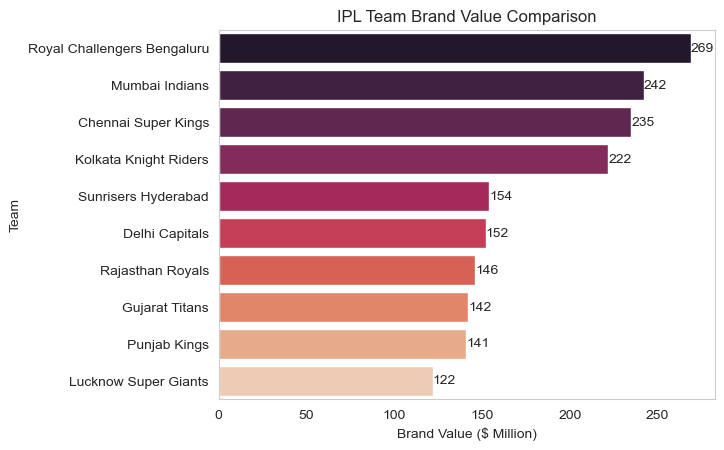
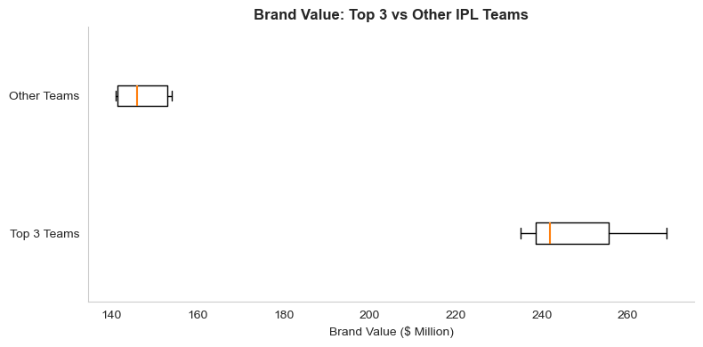

 # Overview
 Welcome to my analysis on IPL. This project was created out of a curiosity of knowing different data aspects of my favourite cricket league. I think these are some of the ways of learning where I all the time feel curious about things and at the same time draw insights out of them. 
 
 IPL(Indian Premier League) is a professional cricket league in India, organised by the Board of Control for Cricket in India(BCCI). Founded in 2007, it features ten city-based franchise teams.

 Through a series of Python scripts, I analysed various data and form insights out of those datasets. All the data is been soursed through basic google searches.

 # Tools I Used

 For my deep dive into the data analyst job market, I harnessed the power of several key tools:

- **Python:** The backbone of my analysis, allowing me to analyze the data and find critical insights.I also used the following Python libraries:
    - **Pandas Library:** This was used to analyze the data. 
    - **Matplotlib Library:** I visualized the data.
    - **Seaborn Library:** Helped me create more advanced visuals. 
- **Jupyter Notebooks:** The tool I used to run my Python scripts which let me easily include my notes and analysis.
- **Visual Studio Code:** My go-to for executing my Python scripts.
- **Git & GitHub:** Essential for version control and sharing my Python code and analysis, ensuring collaboration and project tracking.

# The Questions

Below are the questions I want to answer in my project:

1. What are some key observations on brand value of the teams?

2. Why is there a significant gap between the brand value of the top three teams and the others?

3. How revenue and brand value of teams are related to each other?

4. Brand value depends upon fan engagement. How?


# Data Preparation and Cleanup

This section outlines the steps taken to prepare the data for analysis, ensuring accuracy and usability.

## Import & Clean Up Data

I start by importing necessary libraries and loading the dataset, followed by initial data cleaning tasks to ensure data quality.

```python

import pandas as pd
import numpy as np
import matplotlib.pyplot as plt
import seaborn as sns

sns.set_style("whitegrid")
df = pd.read_excel('/Users/tajveer/Desktop/IPL_team_followers.xlsx')

df['Total Followers'] = df['Total Followers'].str.replace('M', '').astype(float)

df['Brand Value (USD)'] = df['Brand Value (USD)']\
    .str.replace('$', '')\
    .str.replace(' million', '')\
    .astype(float)

df['Net Worth (₹ Crore)'] = df['Net Worth (₹ Crore)']\
    .str.replace('₹', '')\
    .str.replace(',', '')\
    .str.replace(' Cr', '')\
    .astype(float)

```

# The Analysis
I had done all the analysis in a singal jupyter notebook.

## 1. What are some key observations on brand value of the teams?

So, when I was researching about the brand values of different teams. I came to know that there is a significant difference between the brand value of top 3 teams and rest of others.

First of all I started by plotting all the numbers on chart:

```python

df_sorted = df.sort_values('brand_value_usd_m', ascending=False)
sns.barplot(data=df_sorted, x='brand_value_usd_m', y='team', palette='rocket')
plt.title("IPL Team Brand Value Comparison")
plt.xlabel("Brand Value ($ Million)")
plt.ylabel("Team")
for index, value in enumerate(df_sorted['brand_value_usd_m']):
    plt.text(value, index, f'{value:.0f}', va='center')

plt.grid(False)

plt.show()

```
### Results


*Bar graph visualizing IPL Team brand value comparison.*

### Insights:
- Here we can observe that Royal Chalengers franchise holds the highest brand value of approx 269 Milloin USD. This is mainly because the fan base of this franchisee is strong.

- The Fact that names like (Virat kohli, AB de Villiers, Chris Gayle) are associated with this team, justify its valuation.

- After RCB, we have MI and CSK on 2nd and 3rd because they both are 5 times IPL champion, strengthening the reason of high valuation. 

- But if we talk about other teams they don't even come closer to to three. Now let's analyse why!

## 2. Why is there a significant gap between the brand value of the top three teams and the others?

From the previous analysis we can observe that there is a significant gap between the valuation of top 3 teams and rest. 

To have a comparative look of the difference in valuation, I plotted the same on a boxplot:


```python
top_teams_values = df[df['is_top_team'] == True]['brand_value_usd_m']
other_teams_values = df[df['is_top_team'] == False]['brand_value_usd_m']

plt.figure(figsize=(8,4)) 

box = plt.boxplot(
    [top_teams_values, other_teams_values],
    tick_labels=['Top 3 Teams', 'Other Teams'],
    vert=False,
    patch_artist=False,    
    showfliers=False,      
    boxprops=dict(linewidth=1),
    whiskerprops=dict(linewidth=1),
    capprops=dict(linewidth=1),
    medianprops=dict(linewidth=1.5)
)


ax = plt.gca()
ax.spines['top'].set_visible(False)
ax.spines['right'].set_visible(False)


ax.spines['left'].set_linewidth(0.8)
ax.spines['bottom'].set_linewidth(0.8)


plt.grid(False)


plt.title("Brand Value: Top 3 vs Other IPL Teams", fontsize=12, weight='bold')
plt.xlabel("Brand Value ($ Million)", fontsize=10)
plt.ylabel("")

plt.tight_layout()
plt.show()

```
### Results


*Box plots showing brand value comparison between top 3 teams and others*

### Insights:

- Here we can see a big chunk of value is concentrated at top 3 franchise and others are valued almost 60% less!

- Median valuation of top 3 is around 250 Million USD and median of other teams is around 150 Million USD

